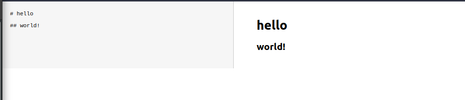

# Simple React Markdown Editor w/ Preview

Author(s): Nicholas O'Kelley

Date: 2022-07-06

## Motivation

The goals of this project was the following:

- Reinforce building React components
- More practice with `useState`
- A challenge to replicate the functionality of another app, but in React!

## Project Execution

After cloning the project run:

```
npm run dev
```

Then in a browser go to `http://localhost:3000/` and you will be able to interact with this
simple editor.

## Pictures of first load



## References

- [Vue.js for having this example to reference](https://vuejs.org/examples/#markdown)
